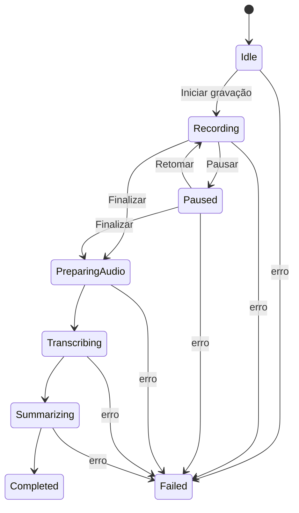

# QAP.ia — Product Definition

**Status:** MVP ampliado — Sprint 9<br>
**Data:** 26/08/2026<br>
**Produto:** QAP.ia<br>
**Domínio:** qapia.com.br<br>
**Tagline provisória:** Grave. Transcreva. Resuma.

## 1. Visão do produto

QAP.ia é um aplicativo nativo para macOS que registra reuniões, preserva o áudio localmente, transcreve o conteúdo com Whisper local e gera um resumo estruturado com Ollama local.

A marca é inspirada em QAP, expressão do Código Q associada a “na escuta”. Essa origem deve aparecer apenas como história da marca: a identidade visual não deve parecer um produto de radioamadorismo.

## 2. Objetivo da V1

Entregar um fluxo local, simples e confiável:

```text
Iniciar → Gravar → Pausar/Retomar → Finalizar → Transcrever → Resumir → Copiar
```

O usuário deve conseguir revisar a transcrição e o resumo da reunião e consultar reuniões anteriores sem login, backend ou sincronização em nuvem.

## 3. Público e necessidade

O produto atende profissionais que participam de reuniões em ferramentas como Google Meet, Zoom, Microsoft Teams, Slack ou navegador e precisam recuperar rapidamente decisões, pendências e próximos passos.

**Necessidade principal:** transformar uma reunião já concluída em um registro útil, privado e estruturado, com o mínimo de interação.

## 4. Princípios do produto

1. **Local-first:** áudio, transcrição e resumo permanecem no Mac.
2. **Privacidade por padrão:** nenhum conteúdo é enviado automaticamente para servidores externos.
3. **Pós-processamento explícito:** Whisper e Ollama só começam após Finalizar.
4. **Controle do usuário:** Pause interrompe totalmente a captura; Resume cria um novo segmento.
5. **Clareza:** cada estado deve comunicar o que está acontecendo e qual é a próxima ação.
6. **Simplicidade nativa:** interface macOS, baixa densidade visual e poucos controles.

## 5. Escopo funcional da V1

### Incluído

- Aplicativo nativo macOS 15+ para Apple Silicon M1 ou superior.
- Nova gravação com áudio do sistema e microfone.
- Pausar e retomar a mesma reunião.
- Segmentação do áudio em arquivos M4A/AAC.
- Finalização a partir dos estados Gravando ou Pausado.
- Transcrição local por segmento com Whisper, somente após Finalizar.
- Combinação das transcrições na ordem dos segmentos.
- Templates de resumo: Reunião Geral, Product Discovery, Refinamento, Daily e Personalizado.
- Geração de resumo Markdown com Ollama local.
- Visualização de resumo e transcrição.
- Cópia integral do resumo para o clipboard do macOS.
- Histórico local de reuniões agrupado por Hoje, Ontem, Esta semana e Anteriores.
- Persistência local com SwiftData e arquivos locais de reunião.
- Preservação do áudio quando Whisper ou Ollama falhar.
- Login Google com acesso somente leitura ao calendário.
- Sugestão e notificação de gravação 10 minutos antes.
- Título, horário e participantes importados do evento.
- Edição do nome e dos participantes da reunião.
- Busca local por título, participantes, data/hora, transcrição e resumo.
- Instalador DMG para execução sem Xcode.

### Fora de escopo

Backend, cloud sync, colaboração, compartilhamento, integrações com plataformas de reunião, transcrição em tempo real, diarização por voz, busca vetorial/semântica, RAG, mobile, Windows, Intel, analytics, telemetria, billing e administração de usuários.

## 6. Fluxo principal e estados



Transições proibidas: Recording → Transcribing, Paused → Transcribing, Recording → Summarizing e Paused → Summarizing.

## 7. Regras de gravação

- Iniciar cria uma Meeting e o primeiro segmento.
- Pausar encerra o segmento atual, interrompe a captura e congela o tempo efetivamente gravado.
- Durante a pausa não há captura nem processamento.
- Retomar mantém a mesma Meeting e cria o próximo segmento.
- Finalizar encerra o segmento atual, se houver, registra `finishedAt` e inicia o pipeline pós-reunião.
- O contador exibido representa tempo efetivamente gravado, não tempo decorrido durante pausas.
- Os segmentos são transcritos individualmente; a V1 não concatena fisicamente os arquivos.

## 8. Templates de resumo

Todos os templates devem orientar a saída em Markdown e deixar explícito quando a transcrição não contém uma informação.

| Template | Estrutura inicial |
|---|---|
| Reunião Geral | Resumo executivo; assuntos; decisões; pendências; próximos passos; responsáveis; prazos |
| Product Discovery | Contexto; problemas; necessidades; insights; feature requests; decisões; próximos passos |
| Refinamento | Contexto; requisitos; regras de negócio; dependências; riscos; pendências; próximos passos |
| Daily | Atualizações; bloqueios; pendências; próximos passos |
| Personalizado | Estrutura definida pelo usuário |

O modelo não pode inventar nomes, responsáveis, datas, decisões ou prazos.

## 9. Privacidade e confiança

- O áudio é a fonte original e não pode ser apagado por falha de transcrição ou resumo.
- Não há telemetria, analytics ou sincronização na V1.
- O usuário deve ser informado quando uma permissão, dispositivo, Whisper ou Ollama impedir o processamento.
- O estado de erro deve preservar a Meeting e permitir recuperar os arquivos existentes.

## 10. Critério de sucesso do MVP

Uma reunião com duas janelas de gravação separadas por uma pausa deve gerar aproximadamente o áudio efetivamente gravado, uma transcrição consolidada, um resumo baseado no template escolhido e o conteúdo copiado para o clipboard.

## 11. Critério de escopo

Antes de implementar qualquer item, perguntar:

> Esta funcionalidade é necessária para completar Start → Pause/Resume → Stop → Whisper → Template → Ollama → Summary → Copy?

Se não for, permanece fora da V1.
