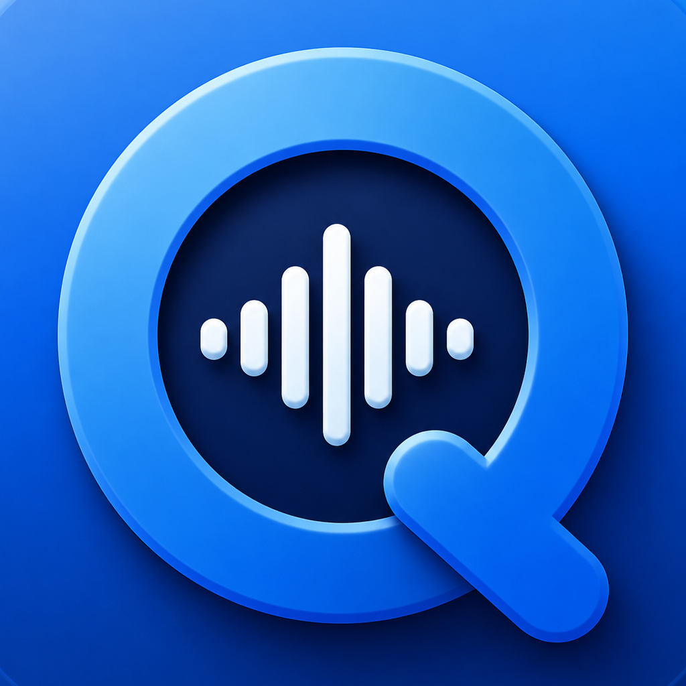
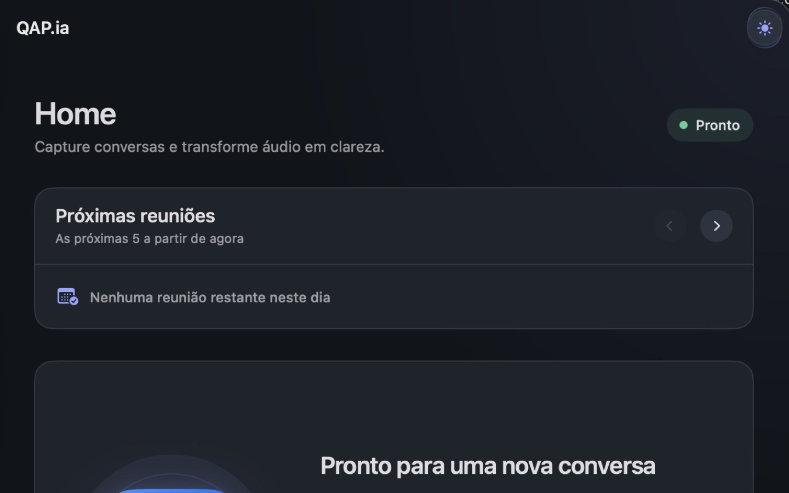
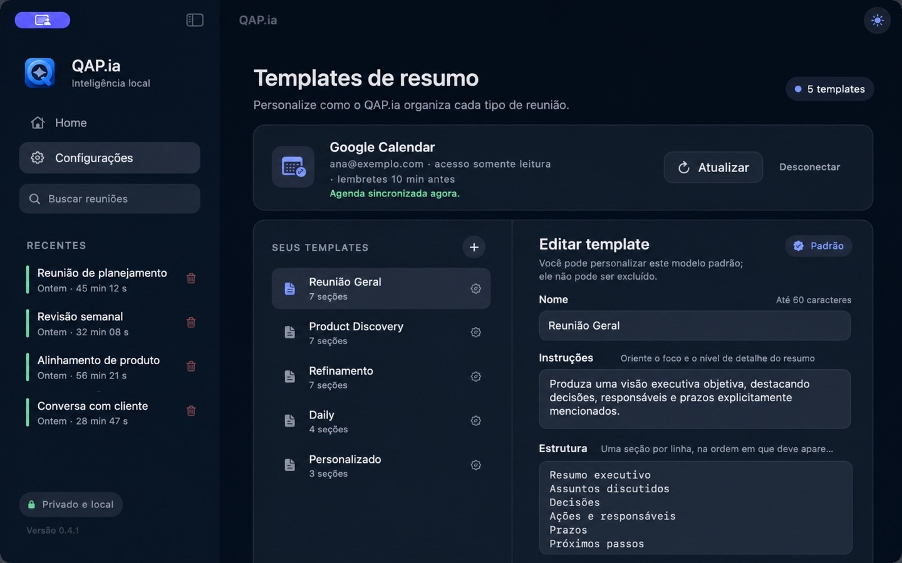

# QAP.ia

<p align="center">
  
</p>

<p align="center">
  Private by design meeting intelligence for macOS
</p>

<p align="center">
  
  
  
  
</p>

QAP.ia is a native macOS application that records meetings, transcribes audio locally and turns conversations into structured summaries. Audio, transcripts and summaries remain on the Mac.

Current stable release: **1.2.3 (build 25)**. See the [changelog](CHANGELOG.md).



## Why QAP.ia

Most meeting assistants depend on cloud processing. QAP.ia takes a local first approach. It captures microphone and system audio, processes the meeting on the device and stores the complete history locally.

The project explores how product design, native macOS capabilities and private artificial intelligence can work together in a focused productivity experience.

## Core capabilities

| Capability | Implementation |
| --- | --- |
| Audio capture | System audio through Core Audio Process Tap and explicit microphone capture through AVFoundation |
| Local transcription | Whisper runs on the Mac and processes ordered recording segments |
| Private summaries | Ollama and a user selected Qwen 3.5 4B or 9B model run entirely on the Mac |
| Meeting awareness | Automatic detection for Google Meet, Microsoft Teams and Zoom |
| Calendar context | Read only Google Calendar integration using OAuth 2.0 and PKCE |
| Searchable history | Meetings, participants, transcripts and summaries stored with SwiftData |
| Summary templates | Built in and custom structures with topics and nested subtopics |
| Resilient recording | Capture manifests preserve usable audio and recover interrupted sessions |
| Background processing | Interrupted transcription and summary work resumes on the next launch |

## Product experience



The interface follows a calm visual system designed for long work sessions. A compact floating indicator shows live audio activity while the main window stays out of the way. Completed summaries can be refined directly in a rich text editor and are saved locally.

## Privacy model

| Data | Handling |
| --- | --- |
| Meeting audio | Stored locally inside Application Support |
| Transcripts | Generated and stored locally |
| Summaries | Generated through a local Ollama runtime |
| Calendar access | Read only access to upcoming events |
| Google session | Protected by the macOS Keychain |
| Whisper model | Downloaded once, verified and stored locally |
| Qwen model | User selected 4B or 9B variant, verified and stored locally |

QAP.ia does not upload meeting audio or transcripts to an artificial intelligence service.

## Architecture

| Layer | Responsibility |
| --- | --- |
| SwiftUI application | Navigation, recording controls, meeting history and settings |
| View models | Product state and user interaction orchestration |
| Capture services | Core Audio Process Tap, explicit microphone input, segmentation and recovery manifests |
| Transcription services | Whisper model preparation, segment processing and transcript assembly |
| Summary services | Ollama preparation, grounded prompting, validation and local generation |
| Storage services | SwiftData persistence and meeting file management |
| Calendar services | OAuth authentication, Keychain storage and event retrieval |

The full design is documented in [Technical Architecture](Docs/qapia-technical-architecture.md).

## Technology

| Area | Technology |
| --- | --- |
| Language | Swift 6 |
| Interface | SwiftUI |
| Audio | Core Audio, AudioToolbox and AVFoundation |
| Persistence | SwiftData and local files |
| Transcription | whisper.cpp |
| Local intelligence | Ollama and Qwen 3.5 |
| Authentication | AuthenticationServices, OAuth 2.0 and PKCE |
| Secure storage | macOS Keychain |

## Requirements

1. macOS 15 or newer
2. Apple Silicon Mac
3. Xcode 16 or newer
4. Microphone and screen recording permission

QAP.ia defaults to the quantized Qwen 3.5 4B model for broader Mac compatibility. The user can select the 9B model in Settings when higher summary quality is preferred.

## Build and test

Run the test suite:

```zsh
swift test
```

Build the macOS application bundle:

```zsh
bash Scripts/build-app-bundle.sh
```

The generated application is placed in the local Build directory, which is intentionally excluded from version control.

## Local artificial intelligence

QAP.ia does not send transcripts to an external artificial intelligence service. The standalone build prepares the official Ollama runtime when needed and validates the application identity. The selected Qwen 3.5 4B or 9B model is verified and downloaded automatically when absent. Summary generation follows the topics and nested subtopics of the selected template and validates structure, numbers and dates before saving the result.

If local model preparation is interrupted, the recording and transcript remain available and setup can resume later.

## Google Calendar

Calendar integration requires a Google OAuth client identifier for the application bundle. No client secret is used or stored.

```zsh
QAPIA_GOOGLE_CLIENT_ID="your-client-id.apps.googleusercontent.com" bash Scripts/build-app-bundle.sh
```

See [Google Calendar Setup](Docs/qapia-google-calendar-setup.md) for the complete configuration.

## Documentation

The [documentation index](Docs/README.md) provides product context, architecture, testing, distribution guidance and implementation decisions.

Release changes are recorded in the [changelog](CHANGELOG.md).

## Repository scope

This repository contains source code, tests, application assets and technical documentation. Build products, signing certificates, provisioning profiles, meeting recordings, transcripts and local credentials are intentionally excluded.

## License

QAP.ia is publicly viewable source code and is not open source under the Open Source Initiative definition.

The software is licensed under the [PolyForm Strict License 1.0.0](LICENSE). It may be used only for noncommercial purposes. Distribution, modification and derivative works are not permitted by the license. Commercial use requires a separate written agreement from the copyright holder.

Copyright 2026 Bruno Augusto. All rights reserved.
